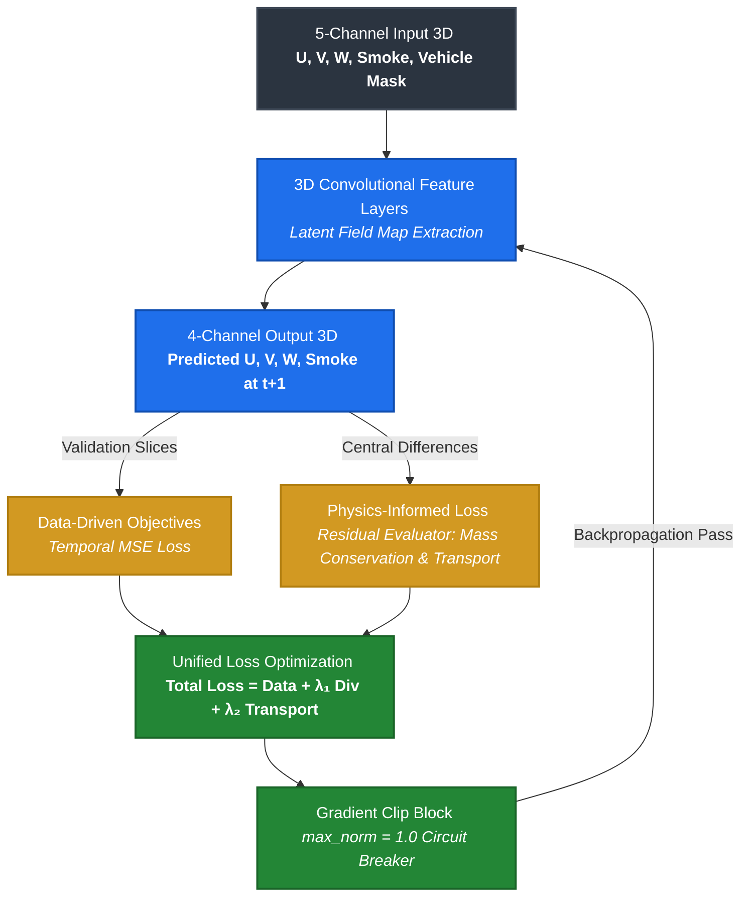

# 3D-PINN-Aerodynamics-

# Physics-Informed Neural Network for Multi-Phase Boundary Flows

A PyTorch implementation of a 3D Physics-Informed Neural Network (PINN) designed to model non-linear transient fluid flows, advection-diffusion boundaries, and wake interactions. The model ingests structural masks alongside high-fidelity volumetric data to output conservation-compliant velocity distributions and scalar smoke transports.

---

# Architectural Overview

Traditional deep learning models treat fluid mechanics as pure image-to-image translations, causing non-physical mass loss and gradient explosions near sharp structural boundaries. This architecture addresses those constraints through an end-to-end 3D Convolutional Network embedded with an inline **Hybrid Physics Loss Layer**.

+----------------------+|  5-Channel Input 3D  | --> [U, V, W, Smoke, Vehicle Mask]+----------------------+|v+----------------------+|   3D Convolutional   | --> Latent Field Map Extraction|    Feature Layers    |+----------------------+|v+----------------------+|  4-Channel Output 3D | --> Predicted [U, V, W, Smoke] at t+1+----------------------+|+---------------------+---------------------+|                                           |v                                           v+-------------------------+                 +-------------------------+|  Data-Driven Objectives |                 |  Physics-Informed Loss  ||     (Temporal MSE)      |                 |   (Residual Evaluator)  |+-------------------------+                 +-------------------------+|                                           |+---------------------+---------------------+|v+--------------------------+| Unified Loss Optimization| --> Gradient Clipped @ 1.0+--------------------------+

---

## Physics-Informed Formulation

The network trains by optimizing a unified objective function across structural data parameters and partial differential equations governing transport and mass continuity:

\[\mathcal{L}_{\text{total}} = \mathcal{L}_{\text{data}} + \lambda_1 \mathcal{L}_{\text{divergence}} + \lambda_2 \mathcal{L}_{\text{transport}}\]

### 1. Incompressibility Constraint (Mass Conservation)
To enforce physical mass conservation, the fluid velocities are driven toward a zero-divergence field via spatial central differences:

\[\mathcal{L}_{\text{divergence}} = \frac{1}{N}\sum \left( \frac{\partial u}{\partial x} + \frac{\partial v}{\partial y} + \frac{\partial w}{\partial z} \right)^2\]

### 2. Scalar Advection-Diffusion Transport
The dynamic propagation of smoke density \(\phi\) is bound to physical advection and diffusion equations using calculated velocity parameters:

\[\mathcal{L}_{\text{transport}} = \frac{1}{N}\sum \left( \left[ u\frac{\partial \phi}{\partial x} + v\frac{\partial \phi}{\partial y} + w\frac{\partial \phi}{\partial z} \right] - D\nabla^2 \phi \right)^2\]

Where \(D\) represents the specified isotropic diffusion coefficient.

---

##  Optimization & Boundary Stabilization Safeguards

When deep neural networks encounter vertical structural discontinuities (\(0.0 \rightarrow 1.0\) masks), calculated gradient variables approach infinity, resulting in runtime crashes. This repository includes two distinct stabilization techniques to safely resolve optimization parameters:

* **Gaussian Boundary Regularization:** Structural shapes are modulated using an optimized Gaussian filter (\(\sigma = 1.2\)). Blurring sharp boundaries translates step discontinuities into continuous profiles, providing stable, differentiable topologies for spatial derivative steps.
* **Inline Norm Circuit Breaker:** Implements a strict gradient clipping ceiling (`max_norm=1.0`) directly preceding optimization adjustments to eliminate structural weight explosion issues caused by transient high-velocity wave interactions.

---

##  Getting Started

### Prerequisites
Ensure your hardware cluster contains a CUDA-compliant GPU for volumetric tensor optimization loops. 

```bash
# Clone the repository
git clone https://github.com
cd 3D-PINN-Aerodynamics

# Install dependencies
pip install -r requirements.txt
```

### Data Workspace Configuration
This training routine expects multi-dimensional array slices conforming to the BLASTNet format. Mount your local dataset workspace matching the structure below:
```text
../input/blastnet-momentum128-3d-sr-dataset/
└── your-dataset-subfolders/
    ├── frame_0001.npy
    └── frame_0002.npy
```

### Execution
Run the optimization script:
```bash
python train_pinn.py
```

NOTE 

This project is fully optimized to run natively in **Kaggle Notebook environments** with GPU acceleration, as well as locally inside **Docker** containers.

---

## 🚀 Interactive Workspace & Quick Start

### ⚡ Run Directly on Kaggle
You can launch, train, and modify this complete architecture without any local setup using Kaggle's free GPU compute infrastructure:
* **[[Link to Kaggle Notebook Workspace](https://www.kaggle.com/code/marymwanzi/momentum128-readandinfer-ec8590)]** 
* Mount Dataset Input: `blastnet-momentum128-3d-sr-dataset`
* Expected Output: Visual wake slice plots and an exported `VehicleFluidPINN.onnx` file ready for Unity deployment.

### 🐳 Local Containerized Execution (Docker)
To run the training routine locally on your own machine or cloud compute cluster with identical environments, use the included Docker configuration:

```bash
# Build the CUDA-accelerated image
docker build -t 3d-pinn-fluid-engine .

# Run the container with GPU access (mount your local dataset directory)
docker run --gpus all \
  -v /path/to/your/local/dataset:/input/blastnet-momentum128-3d-sr-dataset \
  3d-pinn-fluid-engine
```

---

## 🔬 Physics-Informed Loss Layer & Flow Pipeline



### ⚡ Optimization & Boundary Stabilization Safeguards
When deep neural networks encounter absolute vertical boundaries ($0.0 \rightarrow 1.0$ voxel masks), calculated gradient values approach infinity, causing immediate gradient explosions. This architecture bypasses this failure mode using:
* **Gaussian Boundary Regularization:** Applies an inline Gaussian filter ($\sigma = 1.2$) to the vehicle mask grid. Softening sharp edges provides continuous, differentiable spaces for the central difference calculations.
* **Inline Norm Circuit Breaker:** Leverages a strict gradient clipping ceiling (`max_norm=1.0`) directly preceding optimization adjustments to prevent network weights from tearing apart near transient pockets of high velocity.

---

## 🎮 Game Engine Integration (Unity Deploy)
The final cell of the training cycle automatically traces the runtime computational graph and outputs a universal `VehicleFluidPINN.onnx` asset. This model is ready to be imported into **Unity Sentis** for real-time volumetric rendering and interactive fluid-vehicle collisions inside game worlds.
